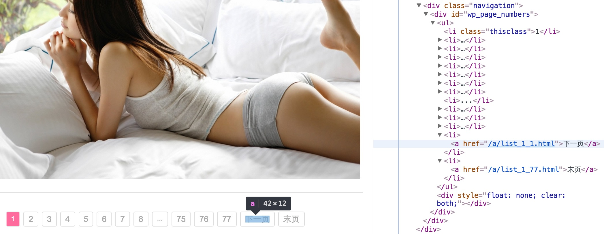
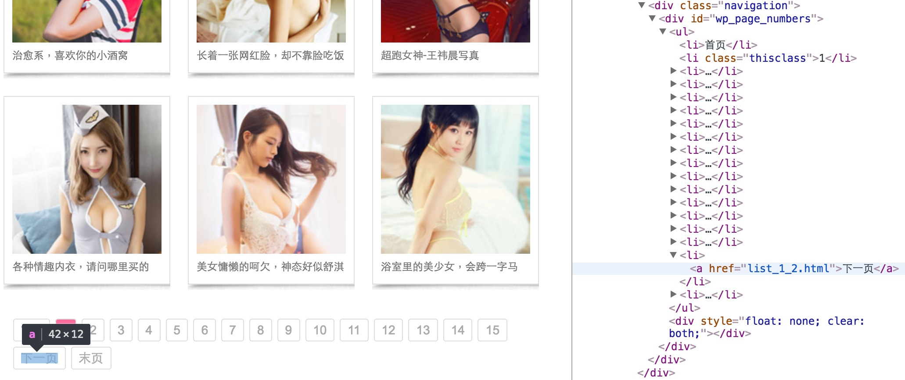
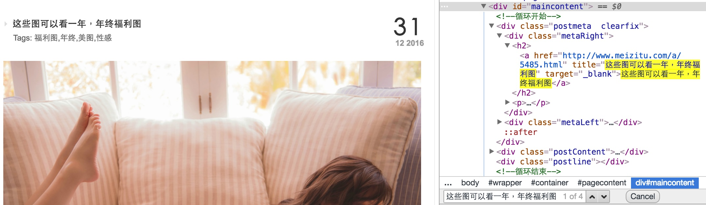
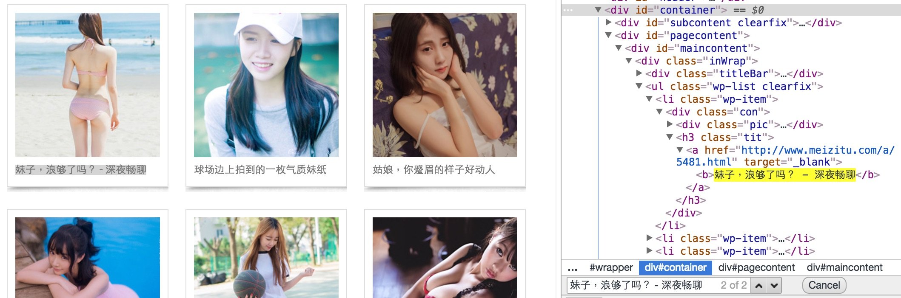
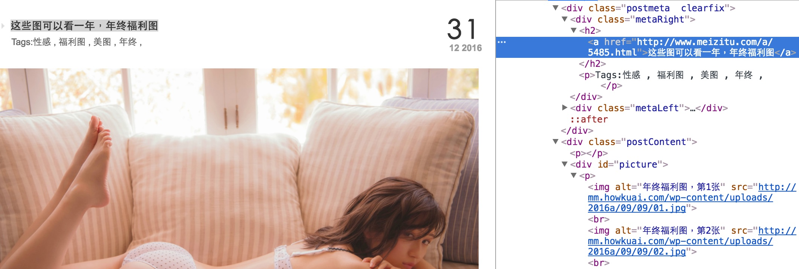

# Meizitu - 練習透過 Scrapy 下載圖片

回想一下小時候怎麼學會騎單車的？
學騎單車最快的方式不是詳看使用說明、不是理解機械構造，表演獨輪特技或是製作單車不是我們的目的。
學會騎車最快的方式是立馬跨上單車 JUST DO IT，透過遊戲過程完成一個不完美但有趣的結果 - 坐在單車上，享受微風輕拂、觀賞時速20的風景。

Python Scrapy 裡面很多學問，但不一定對現在的我都有用，不如找個有趣的主題，快速的、粗淺的認識這個工具。
爬圖這個題目有趣，尤其爬的是美女圖，BJ4。

## 觀察網站

先想像，如果想手動下載 [妹子图](http://www.meizitu.com/) 網站上所有的圖片，會怎麼做？

### Step 1. 網頁編排

發現這個網站差不多每隔幾天貼出幾則文章，當然文章內容就是美女圖。

### Step 2. 網頁導覽

透過 Chrome 開發人員工具觀察網頁下方導覽，得到一個想法：透過不斷點擊「下一页」就可以掃過所以文章列表。

> Chrome > 檢視 > 開發人員選項 > 開發人員工具

首頁：


其它頁面：


### Step 3. 文章連結

針對每個文章列表，由上往下找出每篇文章的連結。

首頁：


其它頁面：


### Step 4. 圖片連結

針對每篇文章，由上往下找出每張圖片的連結。



## 建立專案
```shell
scrapy startproject myproject
cd myproject
scrapy genspider meizitu www.meizitu.com
```

## Item
src: [items.py](myproject/myproject/items.py)

```python
class MeizituItem(scrapy.Item):
    name = scrapy.Field()
    img_urls = scrapy.Field()
```

這個 project 只關心一件事情，就是圖片的 URL。定義一個 Item 容器存放相關信息：

- `name` 文章名
- `img_urls` 圖片連結

## Spider
src: [meizitu.py](myproject/myproject/spiders/meizitu.py)

```python
class MeizituSpider(scrapy.Spider):
    name = "meizitu"
    allowed_domains = ["www.meizitu.com"]
    start_urls = ['http://www.meizitu.com/']

    def parse(self, response):
        ...
```

執行 `scrapy crawl meizitu` 首先從 `start_urls` 開始由 downloader 下載網頁，然後交給 `parse(self, response)` 處理

```python
    def parse(self, response):
        print('>>>>>> %s' % response.url)
        selector = Selector(response)

        links = selector.xpath('//div[@class="metaRight"]/h2/a/@href | //h3[@class="tit"]/a/@href').extract()
        for link in links:
            request = scrapy.Request(link, callback = self.parse_item)
            yield request

        pages = selector.xpath('//div[@id="wp_page_numbers"]/ul/li/a/@href').extract()
        if len(pages) > 2:
            page = pages[-2]
            page = page.replace('/a/', '')
            request = scrapy.Request('http://www.meizitu.com/a/' + page, callback = self.parse)
            yield request
        pass
```

`parse()` 使用 `scrapy.Selector` 將 Response 包裝成方便操作的物件，接著做兩件事情：

- 首先找出文章連結，透過 `xpath('//div[@class="metaRight"]/h2/a/@href | //h3[@class="tit"]/a/@href')` 描述想要抽取的元素，取得文章連結後產生新的 Request，並告訴 Scrapy Engine 將來收到 Response 後交由 `parse_item()` callback 處理。
- 其次在網頁導覽處，透過 `xpath('//div[@id="wp_page_numbers"]/ul/li/a/@href')` 找出「下一页」的連結，取得連結後產生新的 Request，並告訴 Scrapy Engine 將來收到 Response 後交由 `parse()` callback 處理。

```python
    def parse_item(self, response):
        print('  >>>> %s' % response.url)

        loader = ItemLoader(item=MeizituItem(), response=response)
        loader.add_xpath('name', '//h2/a/text()')
        loader.add_xpath('img_urls', '//div/p/img/@src', Identity())
        return loader.load_item()
```

`parse_item()` 得到文章 Response 之後，不使用 `scrapy.Selector` 繼續解析，而是將感興趣的數據裝到 `Item` 裡面：
- 文章名字，透過 xpath `'//h2/a/text()'` 描述，放入 `item['name']` 中
- 圖片連結，透過 xpath `//div/p/img/@src` 描述，放入 `item['img_urls']` 中
- 最後 return 的 item 會透過 `myproject/settings.py` 指定 pipeline 處理。

## Setting
src: [settings.py](myproject/myproject/settings.py)

```python
BOT_NAME = 'myproject'

SPIDER_MODULES = ['myproject.spiders']
NEWSPIDER_MODULE = 'myproject.spiders'

DOWNLOAD_DELAY = 1

ITEM_PIPELINES = {
    'myproject.pipelines.ImageDownloadPipeline': 300,
}
IMAGES_STORE = 'images'

USER_AGENT = 'Mozilla/5.0 (Macintosh; Intel Mac OS X 10_11_5) AppleWebKit/537.36 (KHTML, like Gecko) Chrome/54.0.2840.98 Safari/537.36'
```

- `BOT_NAME`, `SPIDER_MODULES`, `NEWSPIDER_MODULE`： project 預設值，不去動它
- `DOWNLOAD_DELAY` 不能設為零，否則會被網站偵測到你是使用程式下載，將被禁止存取一段時間
- `ITEM_PIPELINES` 指定 item 由那個 pipeline 處理
- `IMAGES_STORE` 指定下載目錄
- `USER_AGENT` 用來偽裝 Request 來自一個正常的瀏覽器

## Pipeline
src: [pipelines.py](myproject/myproject/pipelines.py)

```python
class ImageDownloadPipeline(object):
    def process_item(self, item, spider):
        if 'img_urls' in item:
            dirpath = '%s/%s' % (settings.IMAGES_STORE, spider.name)
            if not os.path.exists(dirpath):
                os.makedirs(dirpath)

            request_data = {...}

            for url in item['img_urls']:
                print('    >> %s' % url)

                filename = '_'.join(url.split('/')[5:])
                filepath = '%s/%s' % (dirpath, filename)
                if os.path.exists(filepath):
                    continue

                request_data['url'] = url
                with open(filepath, 'wb') as handle:
                    response = requests.request(**request_data)
                    for block in response.iter_content(8192):
                        if not block:
                            break
                        handle.write(block)
        pass
```

到了最後一關快大功告成啦，`ImageDownloadPipeline.process_item()` 方法，做以下幾件事情：

- `os.makedirs(dirpath)` 如果圖片目錄不存在，就產生一個
- `request_data = {...}` 產生 HTTP Request Get Header
- 針對每個圖片連結發出 `requests.request(**request_data)`，收到 response 後寫入檔案 `handle.write(block)`

## 執行過程
```shell
$ scrapy crawl -L INFO meizitu
2017-02-01 11:10:39 [scrapy.utils.log] INFO: Scrapy 1.3.0 started (bot: myproject)
2017-02-01 11:10:39 [scrapy.utils.log] INFO: Overridden settings: {'NEWSPIDER_MODULE': 'myproject.spiders', 'ROBOTSTXT_OBEY': True, 'LOG_LEVEL': 'INFO', 'SPIDER_MODULES': ['myproject.spiders'], 'BOT_NAME': 'myproject', 'USER_AGENT': 'Mozilla/5.0 (Macintosh; Intel Mac OS X 10_11_5) AppleWebKit/537.36 (KHTML, like Gecko) Chrome/54.0.2840.98 Safari/537.36', 'DOWNLOAD_DELAY': 1}
2017-02-01 11:10:39 [scrapy.middleware] INFO: Enabled extensions:
['scrapy.extensions.logstats.LogStats',
 'scrapy.extensions.telnet.TelnetConsole',
 'scrapy.extensions.corestats.CoreStats']
2017-02-01 11:10:39 [scrapy.middleware] INFO: Enabled downloader middlewares:
['scrapy.downloadermiddlewares.robotstxt.RobotsTxtMiddleware',
 'scrapy.downloadermiddlewares.httpauth.HttpAuthMiddleware',
 'scrapy.downloadermiddlewares.downloadtimeout.DownloadTimeoutMiddleware',
 'scrapy.downloadermiddlewares.defaultheaders.DefaultHeadersMiddleware',
 'scrapy.downloadermiddlewares.useragent.UserAgentMiddleware',
 'scrapy.downloadermiddlewares.retry.RetryMiddleware',
 'scrapy.downloadermiddlewares.redirect.MetaRefreshMiddleware',
 'scrapy.downloadermiddlewares.httpcompression.HttpCompressionMiddleware',
 'scrapy.downloadermiddlewares.redirect.RedirectMiddleware',
 'scrapy.downloadermiddlewares.cookies.CookiesMiddleware',
 'scrapy.downloadermiddlewares.stats.DownloaderStats']
2017-02-01 11:10:39 [scrapy.middleware] INFO: Enabled spider middlewares:
['scrapy.spidermiddlewares.httperror.HttpErrorMiddleware',
 'scrapy.spidermiddlewares.offsite.OffsiteMiddleware',
 'scrapy.spidermiddlewares.referer.RefererMiddleware',
 'scrapy.spidermiddlewares.urllength.UrlLengthMiddleware',
 'scrapy.spidermiddlewares.depth.DepthMiddleware']
2017-02-01 11:10:39 [scrapy.middleware] INFO: Enabled item pipelines:
['myproject.pipelines.ImageDownloadPipeline']
2017-02-01 11:10:39 [scrapy.core.engine] INFO: Spider opened
2017-02-01 11:10:39 [scrapy.extensions.logstats] INFO: Crawled 0 pages (at 0 pages/min), scraped 0 items (at 0 items/min)
>>>>>> http://www.meizitu.com/
>>>>>> http://www.meizitu.com/a/list_1_1.html
  >>>> http://www.meizitu.com/a/5476.html
    >> http://mm.howkuai.com/wp-content/uploads/2016a/08/31/01.jpg
    >> http://mm.howkuai.com/wp-content/uploads/2016a/08/31/02.jpg
    >> http://mm.howkuai.com/wp-content/uploads/2016a/08/31/03.jpg
    >> http://mm.howkuai.com/wp-content/uploads/2016a/08/31/04.jpg
    >> http://mm.howkuai.com/wp-content/uploads/2016a/08/31/05.jpg
    >> http://mm.howkuai.com/wp-content/uploads/2016a/08/31/06.jpg
    >> http://mm.howkuai.com/wp-content/uploads/2016a/08/31/07.jpg
    >> http://mm.howkuai.com/wp-content/uploads/2016a/08/31/08.jpg
    >> http://mm.howkuai.com/wp-content/uploads/2016a/08/31/09.jpg
    >> http://mm.howkuai.com/wp-content/uploads/2016a/08/31/10.jpg
    >> http://mm.howkuai.com/wp-content/uploads/2016a/08/31/11.jpg
    >> http://mm.howkuai.com/wp-content/uploads/2016a/08/31/12.jpg
2017-02-01 11:11:58 [scrapy.extensions.logstats] INFO: Crawled 4 pages (at 4 pages/min), scraped 1 items (at 1 items/min)
  >>>> http://www.meizitu.com/a/5477.html
    >> http://mm.howkuai.com/wp-content/uploads/2016a/09/01/01.jpg
    >> http://mm.howkuai.com/wp-content/uploads/2016a/09/01/02.jpg
    >> http://mm.howkuai.com/wp-content/uploads/2016a/09/01/03.jpg
    >> http://mm.howkuai.com/wp-content/uploads/2016a/09/01/04.jpg
    >> http://mm.howkuai.com/wp-content/uploads/2016a/09/01/05.jpg
    >> http://mm.howkuai.com/wp-content/uploads/2016a/09/01/06.jpg
  >>>> http://www.meizitu.com/a/5478.html
    >> http://mm.howkuai.com/wp-content/uploads/2016a/09/02/01.jpg
    >> http://mm.howkuai.com/wp-content/uploads/2016a/09/02/02.jpg
    >> http://mm.howkuai.com/wp-content/uploads/2016a/09/02/03.jpg
    >> http://mm.howkuai.com/wp-content/uploads/2016a/09/02/04.jpg
    >> http://mm.howkuai.com/wp-content/uploads/2016a/09/02/05.jpg
    >> http://mm.howkuai.com/wp-content/uploads/2016a/09/02/06.jpg
    >> http://mm.howkuai.com/wp-content/uploads/2016a/09/02/07.jpg
    >> http://mm.howkuai.com/wp-content/uploads/2016a/09/02/08.jpg
    ...
```

> 最後我沒有把整個網站的美女圖都載下來，一來下載要花時間等待 (需要調教效能)、二來已經達到我學習 Scrapy 的目的，所以停手了。

---
## 參考
- [Scrapy 1.0 文档](http://scrapy-chs.readthedocs.io/zh_CN/1.0/index.html)
- [XPath 教程](http://www.w3school.com.cn/xpath/index.asp)
- [Requests 用户指南](http://docs.python-requests.org/zh_CN/latest/index.html)
