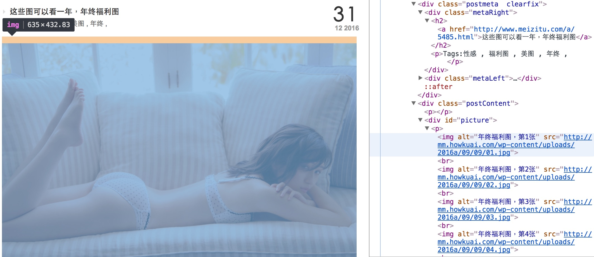

# Meizitu - 練習透過 Scrapy 下載圖片

回想一下小時候怎麼學會騎單車的？
學騎單車最快的方式不是詳看使用說明、不是理解機械構造，表演獨輪特技或是製作單車不是我們的目的。
學會騎車最快的方式是立馬跨上單車 JUST DO IT，透過遊戲過程完成一個不完美但有趣的結果 - 坐在單車上，享受微風輕拂、觀賞時速20的風景。

Python Scrapy 裡面很多學問，但不一定對現在的我都有用，不如找個有趣的主題，快速的、粗淺的認識這個工具。
爬圖這個題目有趣，尤其爬的是美女圖，BJ4。

## 觀察網站

先想像，如果想手動下載 [妹子图](http://www.meizitu.com/) 網站上所有的圖片，會怎麼做？

### Step 1. 網頁編排

發現這個網站差不多每隔幾天貼出幾則文章，當然文章內容就是美女圖。

### Step 2. 網頁導覽

透過 Chrome 開發人員工具觀察網頁下方導覽，得到一個想法：透過不斷點擊「下一页」就可以掃過所以文章列表。

> Chrome > 檢視 > 開發人員選項 > 開發人員工具

首頁：


其它頁面：


### Step 3. 文章連結

針對每個文章列表，由上往下找出每篇文章的連結。

首頁：


其它頁面：


### Step 4. 圖片連結

針對每篇文章，由上往下找出每張圖片的連結。



## 建立專案
```shell
scrapy startproject myproject
cd myproject
scrapy genspider meizitu www.meizitu.com
```

## Item
src: [items.py](myproject/myproject/items.py)

```python
class MeizituSpider(scrapy.Spider):
    name = "meizitu"
    allowed_domains = ["www.meizitu.com"]
    start_urls = ['http://www.meizitu.com/']

    def parse(self, response):
        ...
```

執行 `scrapy crawl meizitu` 首先從 `start_urls` 開始由 downloader 下載網頁，然後交給 `parse(self, response)` 處理

```python
    def parse(self, response):
        print('>>>>>> %s' % response.url)
        selector = Selector(response)

        links = selector.xpath('//div[@class="metaRight"]/h2/a/@href | //h3[@class="tit"]/a/@href').extract()
        for link in links:
            request = scrapy.Request(link, callback = self.parse_item)
            yield request

        pages = selector.xpath('//div[@id="wp_page_numbers"]/ul/li/a/@href').extract()
        if len(pages) > 2:
            page = pages[-2]
            page = page.replace('/a/', '')
            request = scrapy.Request('http://www.meizitu.com/a/' + page, callback = self.parse)
            yield request
        pass
```

`parse()` 使用 `scrapy.Selector` 將 Response 包裝成方便操作的物件，接著做兩件事情：

- 首先找出文章連結，透過 `xpath('//div[@class="metaRight"]/h2/a/@href | //h3[@class="tit"]/a/@href')` 描述想要抽取的元素，取得文章連結後產生新的 Request，並告訴 Scrapy Engine 將來收到 Response 後交由 `parse_item()` callback 處理。
- 其次在網頁導覽處，透過 `xpath('//div[@id="wp_page_numbers"]/ul/li/a/@href')` 找出「下一页」的連結，取得連結後產生新的 Request，並告訴 Scrapy Engine 將來收到 Response 後交由 `parse()` callback 處理。

## Spider
src: [meizitu.py](myproject/myproject/spiders/meizitu.py)

## Setting
src: [settings.py](myproject/myproject/settings.py)

## Pipeline
src: [pipelines.py](myproject/myproject/pipelines.py)

---
## 參考
- [Scrapy 1.0 文档](http://scrapy-chs.readthedocs.io/zh_CN/1.0/index.html)
